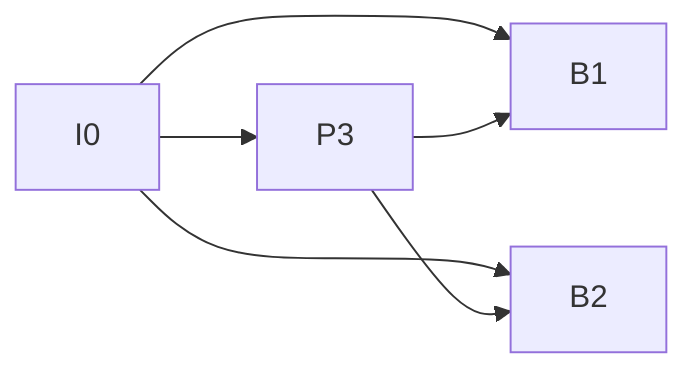

# FFmpeg 视频解码、播放顺序与跳转详解

> 整理日期：2026-10-08。本文根据本次会话整理，按知识依赖重新组织，补充代码中的状态处理和适用条件。
>
> 适用范围：使用现代 FFmpeg `send_packet / receive_frame` API 开发视频读取器或播放器，重点讨论软件解码、本地文件，以及 RTSP 输入的差异。
>
> 验证范围：已对照当前仓库的 MP4 解码实现阅读和整理；本文独立示例尚未编译或运行，不代表项目已经实现播放器、精确跳转或 RTSP 回放。示例中的函数行为可通过文末 FFmpeg 官方参考资料核对。

## 目录

1. [先区分压缩包、解码帧和显示画面](#1-先区分压缩包解码帧和显示画面)
2. [I、P、B 帧及其依赖关系](#2-ipb-帧及其依赖关系)
3. [解码顺序、显示顺序、DTS 与 PTS](#3-解码顺序显示顺序dts-与-pts)
4. [视频进入 FFmpeg 后的完整流程](#4-视频进入-ffmpeg-后的完整流程)
5. [读包与解码的状态机](#5-读包与解码的状态机)
6. [AVFrame、像素格式与内存所有权](#6-avframe像素格式与内存所有权)
7. [时间基与 av_rescale_q](#7-时间基与-av_rescale_q)
8. [av_seek_frame 的参数与定位行为](#8-av_seek_frame-的参数与定位行为)
9. [跳转到 P 帧或 B 帧时怎么办](#9-跳转到-p-帧或-b-帧时怎么办)
10. [播放时钟与音视频同步](#10-播放时钟与音视频同步)
11. [完整的单视频流解码参考代码](#11-完整的单视频流解码参考代码)
12. [RTSP 与本地文件的差异](#12-rtsp-与本地文件的差异)
13. [常见误区与排查方法](#13-常见误区与排查方法)
14. [当前项目的代码对应关系](#14-当前项目的代码对应关系)
15. [函数速查表与参考资料](#15-函数速查表与参考资料)

## 1. 先区分压缩包、解码帧和显示画面

讨论“FFmpeg 解析出视频帧”时，首先要确定处于哪一层。

| 层次 | 数据或对象 | 内容 | 能否直接当作图像显示 |
| --- | --- | --- | --- |
| 输入 | MP4、TS、RTSP 等 | 容器、传输协议、压缩媒体数据 | 不能 |
| 解封装结果 | `AVPacket` | 某个流的压缩数据、时间戳和附加信息 | 不能 |
| 解码结果 | `AVFrame` | 重建后的画面，通常为 YUV 等像素格式 | 可交给兼容的渲染器 |
| 格式转换结果 | RGB、BGR、RGBA 等 | 渲染器或算法需要的像素布局 | 取决于下游接口 |
| 播放输出 | 显示器上的画面 | 在指定显示时间呈现的图像 | 已完成显示 |

职责关系：

```text
打开输入 → 解封装 → 解码 → 可选像素格式转换 → 定时显示
            ↓        ↓
         AVPacket  AVFrame
```

- **解封装**：识别容器或媒体传输格式，分离视频、音频等流，输出压缩包。
- **解码**：还原压缩码流中的图像，处理预测依赖和输出重排。
- **格式转换**：例如把 YUV420P 转成 BGR24，或改变图像尺寸。
- **显示调度**：根据 PTS 和播放时钟决定何时显示画面。

因此，`av_read_frame()` 名字里虽然带有 `frame`，它返回的仍然是 `AVPacket`，不是解码后的像素画面。

## 2. I、P、B 帧及其依赖关系

### 2.1 为什么要进行帧间压缩

相邻视频画面通常有大量相同内容。例如固定摄像头拍摄走廊，只有一个人移动，背景几乎不变。

编码器可以利用已经重建的参考画面进行预测，再编码运动信息和预测误差，从而减少传输的数据。

简化理解：

```text
重建画面 = 预测画面 + 解码后的残差
```

实际编码按块处理，还涉及帧内预测、变换、量化、熵编码及环路滤波等步骤。

### 2.2 I 帧：帧内编码

I 帧利用当前画面内部的信息重建图像，不依赖其他视频画面的像素作为帧间预测参考。

特点：

- 通常数据量较大。
- 常用于提供随机访问或错误恢复的基础。
- 内部仍然经过压缩，不是原始无压缩图片。
- 解码仍需要有效的编码参数，例如 H.264 的 SPS、PPS。

“I 帧可以独立解码”是针对帧间图像依赖而言，并不意味着可以脱离参数集、码流配置和正确的输入格式。

### 2.3 P 帧：预测编码

典型 P 帧使用已经解码的参考画面进行预测，再编码残差。

例如人物向右移动：

```text
参考画面的某个块 → 按运动矢量移动 → 得到预测块 → 加上残差
```

需要注意：

- 不一定参考紧邻的上一帧。
- 可以从多个可用参考画面中选择。
- 并不是简单保存“与上一帧逐像素相减”的结果。
- P 帧中的部分块也可以采用帧内编码。

### 2.4 B 帧：双向预测编码

在典型教学模型中，B 帧可以参考显示时间上位于它前面和后面的画面，因此能更有效地预测当前画面。

但现代编码的规则更灵活：

- B 帧不一定同时使用前后两侧的参考画面。
- “双向”更准确地涉及两组参考列表和相应的预测方式。
- H.264、H.265 中的 B 帧可以作为其他画面的参考帧。
- 分层 B 帧会形成比简单 `I B B P` 更复杂的依赖结构。

播放器通常不需要自己实现这些参考规则，而是交给解码器处理。

严格来说，现代编码标准可能在 slice 等层面定义 I/P/B 类型；日常把一张画面称作 I/P/B 帧，是便于讨论的概括。

### 2.5 对比

| 类型 | 典型预测来源 | 常见压缩表现 | 对播放器的影响 |
| --- | --- | --- | --- |
| I | 当前画面内部 | 单帧数据通常较大 | 常与随机访问点相关 |
| P | 已解码参考画面 | 通常比 I 帧省空间 | 必须满足参考依赖 |
| B | 一组或两组参考画面 | 通常压缩效率较高 | 可能需要等待未来参考和显示重排 |

这不是单帧大小的固定排序。画面内容、质量设置、编码器策略和参考结构都会影响实际大小。

### 2.6 GOP、I 帧与 IDR

GOP，Group of Pictures，表示具有一定预测结构的一组画面。关键帧间隔较长时，压缩效率可能更高，但从之前随机访问点解码到目标的工作量也可能增加。

I 帧和 IDR 不能直接等同：

- 普通 I 帧自身不使用帧间预测，但其后的画面仍可能参考该 I 帧之前的画面。
- H.264 的 IDR 提供参考关系重置，使后续画面不再依赖 IDR 之前的参考画面。
- H.265 还具有 CRA 等随机访问类型，实际还涉及 leading pictures 等规则。

因此，工程上应依靠容器索引、关键帧标记和编码标准支持的随机访问规则，而不是只看到“I”就假定它是完全干净的解码起点。

## 3. 解码顺序、显示顺序、DTS 与 PTS

### 3.1 为什么两种顺序不同

假设显示顺序为：

```text
I0 → B1 → B2 → P3
```

如果 B1、B2 都需要参考 I0 和 P3，解码器必须先得到 P3 的像素，才能还原 B1、B2。

因此一种解码顺序是：

```text
I0 → P3 → B1 → B2
```

依赖图中，箭头表示“提供参考画面”：



解码器缓存 P3，先输出显示时间更早的 B1、B2，最后输出 P3。

### 3.2 DTS 与 PTS

| 名称 | 全称 | 用途 |
| --- | --- | --- |
| DTS | Decoding Time Stamp | 指示解码时间 |
| PTS | Presentation Time Stamp | 指示显示时间 |

有 B 帧时，PTS 与 DTS 可能不同。即使没有 B 帧，也不能假设所有输入中的时间戳一定完整、连续或完全相等。

`AVPacket` 常见字段：

```c
packet->stream_index
packet->pts
packet->dts
packet->duration
packet->flags
```

正常 `av_read_frame()` 流程中，这些包时间戳按相应输入流的 `AVStream.time_base` 表示；未知时间戳使用 `AV_NOPTS_VALUE`。

### 3.3 播放器应该采用什么顺序

基本规则：

```text
压缩包：按解封装器输出的码流顺序送入解码器。
解码帧：按解码器输出顺序接收，并根据显示时间戳调度。
```

对常见视频解码器，`avcodec_receive_frame()` 已经完成所需的显示重排，通常无需播放器再次按 I/P/B 类型排序。

不要把压缩包按 PTS 排序后再送入解码器，也不要按 I→P→B 的类型顺序拼接画面。

异常时间戳、拼接文件、跳转和断流重连需要额外处理，但这些属于时间轴和播放器状态管理，不是重新实现编码器的参考结构。

## 4. 视频进入 FFmpeg 后的完整流程

### 4.1 总体函数链

```text
avformat_network_init()              按需初始化网络模块
        ↓
avformat_open_input()                打开文件或网络输入
        ↓
avformat_find_stream_info()          探测流信息
        ↓
av_find_best_stream()                选择视频流并可取得解码器
        ↓
avcodec_alloc_context3()             分配解码器上下文
        ↓
avcodec_parameters_to_context()      复制流中的编码参数
        ↓
decoder_ctx->pkt_timebase = stream->time_base
        ↓
avcodec_open2()                      打开解码器
        ↓
av_packet_alloc() / av_frame_alloc()  分配包和帧容器
        ↓
av_read_frame()                      读取压缩包
        ↓
avcodec_send_packet()                提交压缩包
        ↓
avcodec_receive_frame()              接收解码画面
        ↓
可选 sws_scale()                    转换像素格式或尺寸
        ↓
保存 / 算法处理 / 根据 PTS 显示
        ↓
输入正常 EOF：send_packet(NULL) → receive_frame() 直到解码器 EOF
        ↓
释放资源
```

这里的 `av_find_best_stream()` 可以返回解码器，因此不必再无条件调用一次 `avcodec_find_decoder()`。

### 4.2 按需初始化网络

```c
int ret = avformat_network_init();
```

本地文件不需要网络初始化。网络初始化是否必要取决于 FFmpeg 构建和依赖；它不是每个包或每条解码线程都需要执行的操作。需要使用时，通常在程序启动阶段统一调用，并在退出时配对：

```c
avformat_network_deinit();
```

### 4.3 打开输入

```c
AVFormatContext *format_ctx = NULL;

int ret = avformat_open_input(
    &format_ctx,
    input_url,
    NULL,        // 自动选择输入格式
    NULL         // 可选参数字典
);
```

这个函数负责打开输入、选择解封装器并读取头部等信息，不代表整个媒体已经读入内存，也不代表已经完成视频像素解码。

RTSP 选项示例：

```c
AVDictionary *options = NULL;
av_dict_set(&options, "rtsp_transport", "tcp", 0);

int ret = avformat_open_input(
    &format_ctx, input_url, NULL, &options
);

// 调用返回后释放字典；其中可能留有未被识别或消费的选项。
av_dict_free(&options);
```

阻塞输入需要取消能力时，应提前创建 `AVFormatContext` 并设置 `interrupt_callback`，而不是等读包阻塞之后再补设。

### 4.4 探测流信息

```c
ret = avformat_find_stream_info(format_ctx, NULL);
```

这个过程可能读取数据包，必要时还可能进行部分解码，以完善流参数，不应理解成只解析一个静态容器头。

主要结果包括：

```c
format_ctx->nb_streams
format_ctx->streams[i]->codecpar
format_ctx->streams[i]->time_base
format_ctx->streams[i]->start_time
format_ctx->streams[i]->duration
```

实时输入的探测量会影响启动耗时，但盲目减小探测参数可能导致流信息不完整。

### 4.5 选择视频流和解码器

```c
const AVCodec *decoder = NULL;

int video_index = av_find_best_stream(
    format_ctx,
    AVMEDIA_TYPE_VIDEO,
    -1, -1,
    &decoder,
    0
);
```

成功时返回视频流索引；失败时返回负的错误码。

如果自己遍历选择流，可以另外调用：

```c
const AVCodec *decoder = avcodec_find_decoder(
    format_ctx->streams[video_index]->codecpar->codec_id
);
```

多路视频、不同清晰度或指定摄像头轨道时，应按产品要求选择流，不能总是假设索引 0 是目标视频。

### 4.6 配置并打开解码器

```c
AVStream *stream = format_ctx->streams[video_index];
AVCodecContext *decoder_ctx = avcodec_alloc_context3(decoder);

int ret = avcodec_parameters_to_context(
    decoder_ctx, stream->codecpar
);

decoder_ctx->pkt_timebase = stream->time_base;

ret = avcodec_open2(decoder_ctx, decoder, NULL);
```

以上为调用顺序片段，实际必须逐步检查分配结果和返回值。`codecpar` 保存流中的编码参数；`AVCodecContext` 保存运行中的解码状态，两者职责不同。

不要把解码器的 `time_base` 与输入流的时间基混为一谈。这里明确设置 `pkt_timebase`，声明传入包时间戳的单位。

### 4.7 读包、筛选、解码

```c
av_read_frame(format_ctx, packet);
avcodec_send_packet(decoder_ctx, packet);
avcodec_receive_frame(decoder_ctx, frame);
```

这三个函数不是简单的一次调用对应一次输出，必须通过下一节的状态机协调。

### 4.8 是否需要自己调用 parser

对于普通 MP4、TS、RTSP 输入，`libavformat` 会根据输入格式处理包边界，并可能按需使用 parser。应用一般不需要再手动调用 `av_parser_parse2()`。

如果输入来自自定义 socket，拿到的是任意分段的 H.264/H.265 裸字节流，可能需要：

```text
av_parser_init()
av_parser_parse2()
av_parser_close()
```

parser 的职责是解析码流边界和相关信息，仍然不输出像素图像。RTP 分片重组、NAL 单元和编码画面边界也不能简单等同。

## 5. 读包与解码的状态机

### 5.1 包与输出画面不保证一一对应

对很多普通视频输入，解封装器会给出接近“一包一个编码画面”的数据。但解码 API 仍然必须按零个、一个或多个输出进行处理。

即使一个包对应一个编码画面，也可能因为 B 帧重排或帧线程延迟，提交后暂时没有输出。

### 5.2 `avcodec_send_packet()`

| 返回值 | 含义 | 应用处理 |
| --- | --- | --- |
| `0` | 当前输入已被接受 | 可以解除调用方的包引用，再接收输出 |
| `AVERROR(EAGAIN)` | 当前不能接受输入 | 保留这个包，先接收输出，然后重试同一个包 |
| `AVERROR_EOF` | 解码器已经进入结束状态 | 不能继续普通送包；复用解码器需要重置 |
| 其他负数 | 错误 | 按策略报错或恢复，不应静默吞掉 |

重要规则：

```text
send_packet 返回 EAGAIN
    ≠ 这个包已经被接收
    ≠ 等待一会儿就自动恢复
```

这表示应切换到接收端取得输出。若立刻 `av_packet_unref()` 后去读下一个包，就可能丢掉尚未提交成功的数据。

### 5.3 `avcodec_receive_frame()`

| 返回值 | 含义 | 应用处理 |
| --- | --- | --- |
| `0` | 成功得到一张画面 | 处理后继续接收 |
| `AVERROR(EAGAIN)` | 当前需要更多输入 | 返回送包或读包流程 |
| `AVERROR_EOF` | 排空已经完成 | 结束当前解码过程 |
| 其他负数 | 解码错误 | 报错或执行明确的恢复策略 |

一次成功送包之后，通常循环接收直到 `EAGAIN`。解码器两端的 `EAGAIN` 是状态转换提示，不是网络超时。

### 5.4 `av_read_frame()` 的返回值不能与解码器混淆

- `0` 或其他非负返回值：成功读到包。
- `AVERROR_EOF`：正常输入结束。
- `AVERROR(EAGAIN)`：某些非阻塞输入暂时没有数据，应按输入层策略重试。
- 其他负值：网络、I/O、格式或中断错误等。

不要把所有负值都当成正常文件结束。否则会掩盖断流、损坏文件或用户取消。

### 5.5 正常 EOF 要排空解码器

正常读到输入 EOF 后：

```c
avcodec_send_packet(decoder_ctx, NULL);
```

空包被成功接受后，持续调用：

```c
avcodec_receive_frame(decoder_ctx, frame);
```

直到解码器返回 `AVERROR_EOF`，把尾部延迟画面全部输出。

如果发送空包返回 `EAGAIN`，仍然要先接收已有输出，再重试发送空包。空包尚未接受时不能声称已经完成排空。

成功进入 draining 后，预期接收端最终返回 EOF；此时若出现 `EAGAIN`，不应简单当作正常结束，因为已经不会再有普通输入包。

### 5.6 Drain 与 flush 的区别

| 操作 | 目的 | 是否输出内部待显示画面 | 使用时机 |
| --- | --- | --- | --- |
| `avcodec_send_packet(ctx, NULL)` | 进入排空状态 | 是 | 文件正常结束 |
| `avcodec_flush_buffers(ctx)` | 重置解码状态 | 丢弃尚未输出的内容 | seek 后或需要复用解码器时 |

```text
文件播完：把尾帧取出来。
用户跳转：把旧位置状态丢掉。
```

两者不能互相替代。

## 6. AVFrame、像素格式与内存所有权

### 6.1 常用字段

```c
frame->width
frame->height
frame->format
frame->data[]
frame->linesize[]
frame->pts
frame->best_effort_timestamp
```

视频解码器输出可能是 YUV420P、NV12、10-bit YUV、RGB 等格式，不能固定假设三个平面。

例如：

| 格式 | 典型布局 |
| --- | --- |
| YUV420P | Y、U、V 三个平面 |
| NV12 | Y 平面，加交错 UV 平面 |
| RGB24 | RGB 打包像素 |
| BGR24 | BGR 打包像素，常用于图像处理 |
| RGBA | RGBA 打包像素 |

`linesize` 是行跨度，可能包含对齐填充，不一定等于 `width × 每像素字节数`。部分图像布局还允许负行跨度。

### 6.2 像素格式转换

根据实际输出帧创建或更新转换器：

```c
sws_ctx = sws_getCachedContext(
    sws_ctx,
    frame->width, frame->height,
    (enum AVPixelFormat)frame->format,
    frame->width, frame->height,
    AV_PIX_FMT_RGBA,
    SWS_BILINEAR,
    NULL, NULL, NULL
);
```

分配目标帧：

```c
AVFrame *rgba = av_frame_alloc();
rgba->format = AV_PIX_FMT_RGBA;
rgba->width = frame->width;
rgba->height = frame->height;

int ret = av_frame_get_buffer(rgba, 32);
```

转换前确保目标可写，再执行转换：

```c
int ret = av_frame_make_writable(rgba);
if (ret < 0) {
    // 处理错误。
}

int rows = sws_scale(
    sws_ctx,
    (const uint8_t * const *)frame->data,
    frame->linesize,
    0,
    frame->height,
    rgba->data,
    rgba->linesize
);
```

这些片段省略了统一的错误收尾；实际应检查指针、返回值和输出行数。分辨率改变时，还要重新分配匹配尺寸的目标缓冲区。输出像素格式改变时同样需要重新配置。

颜色范围、矩阵、色彩空间、HDR、旋转和像素宽高比也会影响最终显示；简单 `sws_scale()` 示例只覆盖像素转换主流程。

### 6.3 转换不是必须的

如果渲染器支持解码器输出的 YUV/NV12，可以直接上传相应平面，避免 CPU 上额外转换成 RGB。

“像素格式不变”不是判断是否需要转换的唯一条件，应以渲染器或算法能否正确消费该格式为准。

### 6.4 跨线程不能只保存裸指针

`avcodec_receive_frame()` 复用一个 `AVFrame` 时，下一次接收或主动 unref 会改变该对象持有的引用。

错误思路：

```c
queue.push(frame->data[0]); // 只保存裸像素地址，没有管理所有权
```

正确选择包括：

```c
AVFrame *queued_frame = av_frame_clone(frame);
```

或者创建新帧并使用：

```c
av_frame_ref(queued_frame, frame);
```

也可以把图像深拷贝到应用自己持有的缓冲区。

`av_frame_clone()` 和 `av_frame_ref()` 通常共享引用计数的像素缓冲，不是像素深拷贝。需要修改共享画面时，应先确保可写。

消费者使用完之后调用 `av_frame_free()` 或相应的 unref。`av_packet_unref()` 释放包中的引用，`av_packet_free()` 还会释放包对象本身；帧的 unref/free 同理。

### 6.5 硬件帧例外

硬件解码的 `AVFrame` 可能引用 GPU 表面，`data[]` 不能直接当作普通 CPU 像素数组传给 `sws_scale()`。

通常需要直接交给兼容的 GPU 渲染路径，或者使用 `av_hwframe_transfer_data()` 下载到软件帧，再进行 CPU 格式转换。

## 7. 时间基与 av_rescale_q

### 7.1 时间戳是“计数”，时间基是“每格多长”

```c
typedef struct AVRational {
    int num;
    int den;
} AVRational;
```

如果：

```text
time_base = 1/90000 秒
PTS       = 180000
```

实际时间就是：

```text
180000 × 1/90000 = 2 秒
```

常见时间基：

| 时间基 | 单位含义 |
| --- | --- |
| `1/1000` | 毫秒 |
| `1/1000000` | 微秒 |
| `1/90000` | 每格为 1/90000 秒 |
| `1/25` | 每格为 1/25 秒；某些固定帧率场景可采用 |

帧率不是时间基。25 fps 视频的输入流时间基完全可能是 `1/90000`，每帧时间戳通常增加 3600。

### 7.2 函数原型与计算公式

```c
int64_t av_rescale_q(int64_t a, AVRational bq, AVRational cq);
```

参数含义：

- `a`：原时间基下的整数计数。
- `bq`：原时间基。
- `cq`：目标时间基。

计算：

```text
目标计数 = a × bq / cq
         = a × bq.num × cq.den / (bq.den × cq.num)
```

它做的是单位换算，不改变实际代表的时间，也不会自动扣除视频起点。

### 7.3 2.5 秒换算示例

```c
const AVRational microseconds = {1, AV_TIME_BASE};
const AVRational video_tb = {1, 90000};

int64_t target_us = 2500000;
int64_t target_ts = av_rescale_q(target_us, microseconds, video_tb);
// target_ts = 225000
```

反向换算：

```c
int64_t pts_us = av_rescale_q(225000, video_tb, microseconds);
// pts_us = 2500000
```

`AV_TIME_BASE` 等于 1000000，`AV_TIME_BASE_Q` 表示微秒时间基。在 C 中可以直接使用该宏；C++ 中也可以显式声明 `AVRational{1, AV_TIME_BASE}`。

### 7.4 为什么用它而不是直接乘除

直接写多个整数乘法可能在最终除法之前发生中间值溢出；先除后乘又可能过早丢失精度。

FFmpeg 的缩放函数用于安全地进行整数有理数换算，避免不必要的中间溢出。它不能让超出最终 `int64_t` 可表示范围的任意输入都变得有效；仍然应使用合理的数值范围和有效时间基。

`av_q2d()` 适合把有理数转换成浮点数用于展示或计算。它并不是不可用，但长期维护播放器内部时间轴时，统一的整数单位通常更容易保持精度和一致性。

### 7.5 舍入规则

`av_rescale_q()` 使用 `AV_ROUND_NEAR_INF`：取最近整数，正好位于中间时向远离零的方向取整。

需要指定方向时使用：

```c
int64_t result = av_rescale_q_rnd(
    value, src_tb, dst_tb, AV_ROUND_DOWN
);
```

| 标志 | 含义 |
| --- | --- |
| `AV_ROUND_ZERO` | 向零取整 |
| `AV_ROUND_INF` | 远离零取整 |
| `AV_ROUND_DOWN` | 向负无穷取整 |
| `AV_ROUND_UP` | 向正无穷取整 |
| `AV_ROUND_NEAR_INF` | 取最近值，中点远离零 |

例如 `-1.5` 向零取整是 `-1`，向负无穷取整是 `-2`，两者不同。

### 7.6 无效时间戳与比较

先判断：

```c
if (pts != AV_NOPTS_VALUE) {
    int64_t pts_us = av_rescale_q(pts, stream_tb, microseconds);
}
```

不要直接缩放 `AV_NOPTS_VALUE` 再把结果当成合法时间。`av_rescale_q_rnd()` 支持组合 `AV_ROUND_PASS_MINMAX` 保留极值哨兵，但业务逻辑仍然需要判断未知时间。

两个时间戳来自不同时间基时，可以使用：

```c
int cmp = av_compare_ts(pts_a, tb_a, pts_b, tb_b);
```

负数、零、正数分别表示前者早于、等于、晚于后者。双方都应是有效时间戳。

## 8. av_seek_frame 的参数与定位行为

### 8.1 函数原型

```c
int av_seek_frame(
    AVFormatContext *s,
    int stream_index,
    int64_t timestamp,
    int flags
);
```

它作用于解封装器，把后续读包位置移动到指定位置附近。通常依靠容器索引、时间戳搜索或解封装器自己的定位能力。

它不负责：

- 把压缩视频解码成像素。
- 自动输出目标画面。
- 清空 `AVCodecContext` 的旧参考帧。
- 清空应用自己的包队列、帧队列或音频播放缓冲。
- 自动让目标 P/B 帧获得缺失的参考图像。

成功返回非负值，失败返回负错误码。

### 8.2 `stream_index` 决定时间戳单位

| 参数 | `timestamp` 的单位 |
| --- | --- |
| 具体流索引，例如 `video_index` | `format_ctx->streams[video_index]->time_base` |
| `-1` | `AV_TIME_BASE` 单位，即微秒；由 FFmpeg 选择默认流 |

上述表格针对普通时间定位；`BYTE` 和 `FRAME` 标志会改变参数含义。

示例一，指定视频流：

```c
int64_t target_ts = av_rescale_q(
    absolute_target_us,
    AV_TIME_BASE_Q,
    video_stream->time_base
);

int ret = av_seek_frame(
    format_ctx, video_index, target_ts, AVSEEK_FLAG_BACKWARD
);
```

示例二，使用全局微秒单位：

```c
int ret = av_seek_frame(
    format_ctx, -1, absolute_target_us, AVSEEK_FLAG_BACKWARD
);
```

“微秒单位”只说明刻度，不代表 timestamp 自动变成“从用户进度条零点开始的相对时间”。两种方式都必须考虑输入时间轴的原点。

### 8.3 主要 flags

| 标志 | 作用 | 使用注意 |
| --- | --- | --- |
| `AVSEEK_FLAG_BACKWARD` | 请求目标时间之前方向的定位点 | 常用于从目标前的关键帧开始精确解码 |
| `AVSEEK_FLAG_ANY` | 允许把非关键帧当作定位候选 | 不会消除参考依赖；部分解封装器不支持 |
| `AVSEEK_FLAG_BYTE` | 按字节位置定位 | 此时 timestamp 是字节位置，不是时间 |
| `AVSEEK_FLAG_FRAME` | 按帧序号表达定位目标 | 支持依赖输入格式，不是通用逐帧随机访问 |

在常见索引定位路径中，`BACKWARD` 倾向于选择不晚于目标的关键帧；未设置时可能选择目标之后的定位点。具体支持程度和最终读包位置仍由容器、索引、时间戳和解封装器实现决定。

不要把它理解成“无论什么媒体都严格定位到前一个 IDR”的保证，成功之后仍然要用解码输出的 PTS 确认目标。

### 8.4 起始时间与用户时间轴

假设视频流：

```text
time_base         = 1/90000
stream.start_time = 900000，也就是 10 秒
```

如果播放器定义“用户 0 秒对应视频流开始”，用户跳到 2.5 秒，则原始目标时间戳为：

```text
900000 + 225000 = 1125000
```

视频流单独作为原点的示意：

```c
int64_t target_ts = av_rescale_q(
    relative_target_us, AV_TIME_BASE_Q, stream->time_base
);

if (stream->start_time != AV_NOPTS_VALUE) {
    target_ts += stream->start_time;
}
```

音视频播放器通常需要统一原点，例如选择有效的 `format_ctx->start_time`，而不是给音频和视频各自减去不同起点，破坏原本的相对偏移。

单位区别：

```text
AVFormatContext.start_time：微秒。
AVStream.start_time：该流的 time_base。
```

建议播放器在打开输入时明确选定一个公共 `origin_us`，后续统一使用：

```text
绝对目标微秒 = origin_us + 用户相对目标微秒
绝对帧微秒   = av_rescale_q(帧 PTS, 流时间基, 微秒时间基)
用户时间     = 绝对帧微秒 - origin_us
```

若起点未知，要选择并记录回退策略。重连和不连续输入也要重新审视时间轴，不能无条件加一次 `start_time`。

### 8.5 与 `avformat_seek_file()` 的区别

```c
int avformat_seek_file(
    AVFormatContext *s,
    int stream_index,
    int64_t min_ts,
    int64_t ts,
    int64_t max_ts,
    int flags
);
```

它允许传入最早、期望和最晚定位时间，并尝试找到范围内、适合活动流解码的定位点。

```text
min_ts ≤ ts ≤ max_ts
```

其时间戳单位规则也由 `stream_index` 决定。要特别注意：按 API 约定，`AVSEEK_FLAG_BACKWARD` 对该函数被忽略；不要照搬 `av_seek_frame()` 的标志解释。

例如，用上界限制不晚于目标的定位范围：

```c
int ret = avformat_seek_file(
    format_ctx,
    video_index,
    INT64_MIN,
    target_ts,
    target_ts,
    0
);
```

这仍然依赖输入格式的支持，而且不是“直接返回精确画面”。不能在不考虑关键帧间隔的情况下把范围收得过窄，否则可能没有可用定位点。

## 9. 跳转到 P 帧或 B 帧时怎么办

### 9.1 解码起点与显示起点分离

假设显示顺序：

```text
I0 → B1 → B2 → P3 → B4 → B5 → P6
                      ↑
                  目标画面 B4
```

如果 I0 是可用随机访问点，则：

```text
先定位到 I0
    ↓
清空旧解码状态
    ↓
按码流顺序继续解码
    ↓
丢弃 I0、B1、B2、P3 的输出画面
    ↓
显示 B4，并继续正常播放
```

如果 B4 依赖 P6，解码器会先解码 P6，再输出 B4。应用只需要继续供包和接收输出。

丢弃的是解码后的显示输出，不能随意跳过目标之前的压缩参考包。

### 9.2 一次精确跳转的工程步骤

1. 接收跳转请求，阻止旧位置的数据继续进入有效播放队列。
2. 协调读包、解码、渲染线程，使输入和解码上下文处于可安全操作状态。
3. 把用户目标换算到输入流的绝对时间戳。
4. 调用 seek，定位到目标之前可用的随机访问位置。
5. 成功后清空应用队列和解码器缓存。
6. 重置 EOF、draining、同步时钟、音频重采样及滤镜等相关状态。
7. 从新位置读包并解码。
8. 按有效 PTS 丢弃目标前的视频输出。
9. 目标画面准备好后建立新的播放时钟锚点，恢复显示与音频输出。

不能在一个线程 `av_read_frame()` 的同时，另一个线程直接对同一上下文 seek；也不要并发对同一解码器进行 flush 和 send/receive。

### 9.3 seek 核心函数片段

下面函数只演示同步执行的“定位 + 清空视频解码器”，应用队列和音频状态必须由调用方处理。

```c
static int seek_video(
    AVFormatContext *fmt,
    AVCodecContext *dec,
    int video_index,
    int64_t relative_target_us,
    int64_t origin_us,
    int64_t *out_target_ts
) {
    AVStream *stream = fmt->streams[video_index];

    // 调用方需校验范围，确保这里的加法不会溢出。
    int64_t absolute_target_us = origin_us + relative_target_us;
    int64_t target_ts = av_rescale_q(
        absolute_target_us, AV_TIME_BASE_Q, stream->time_base
    );

    int ret = av_seek_frame(
        fmt, video_index, target_ts, AVSEEK_FLAG_BACKWARD
    );
    if (ret < 0) {
        return ret;
    }

    avcodec_flush_buffers(dec);
    *out_target_ts = target_ts;
    return 0;
}
```

失败时应向上层报告并采取明确恢复策略。不要假设失败一定意味着底层读取状态完全没有变化。

### 9.4 解码输出过滤

```c
int64_t pts = frame->best_effort_timestamp;

if (seeking) {
    if (pts == AV_NOPTS_VALUE) {
        // 采用事先定义的未知时间戳策略。
        // 单凭该帧无法判断是否到达精确目标。
        av_frame_unref(frame);
        continue;
    }

    if (av_compare_ts(pts, stream->time_base,
                      target_ts, stream->time_base) < 0) {
        av_frame_unref(frame);
        continue;
    }

    seeking = 0;
    // 重新建立时钟锚点，然后进入正常输出流程。
}
```

这里选择“第一帧 PTS 不早于目标”的策略。另一种产品语义是选择目标时刻正在显示的画面，这可能需要保留目标前的最后一帧，并结合下一帧 PTS 或帧时长判断。

所以“精确跳转”也要明确首帧选择规则；目标时间位于两帧之间时，并不存在一张恰好对应任意微秒值的新画面。

### 9.5 多线程旧数据隔离

常见做法是维护递增的 seek 序号或播放代数：

```text
seek 前的数据：serial = 7
新跳转请求：  serial = 8
seek 后的数据：serial = 8
```

包和帧携带所属序号。渲染和音频输出发现数据属于旧序号时，直接丢弃。

这个方法用于隔离在途旧数据，不能替代线程同步、队列清空和解码器 flush。

### 9.6 快速跳转与精确跳转

| 模式 | 行为 | 代价 |
| --- | --- | --- |
| 快速跳转 | 定位到附近可用关键帧后就显示 | 时间可能偏离目标 |
| 精确跳转 | 从之前随机访问点解码到目标，再显示 | 要额外解码一段画面 |

是否使用 B 帧、关键帧间隔、存储读取速度和解码性能，都会影响跳转耗时。

有音频时，还要丢弃目标前的音频数据，必要时裁剪跨越目标时间的音频帧样本，并处理设备缓冲，不能只跳视频。

## 10. 播放时钟与音视频同步

### 10.1 解码速度不是播放速度

离线解码可能每秒产出几百张画面，但视频原本只有 25 fps。如果拿到帧就显示，会以解码速度播放。

播放器需要播放时钟，按时间戳控制显示。

### 10.2 纯视频的时钟锚点

设：

```text
first_pts_us：本轮播放的首帧显示时间戳
start_clock_us：首帧对应的本地单调时钟
```

则：

```text
目标显示时钟 = start_clock_us + (当前 pts_us - first_pts_us)
```

比较目标与当前单调时钟：

- 目标还没到：等待，但应能被暂停、停止和 seek 打断。
- 目标已到：显示。
- 明显落后：按产品策略丢弃过时的解码输出。

倍速为 `speed` 时，媒体时间差需要按播放速度映射到本地时间差。暂停恢复、seek 和时间轴跳变后，也要调整或重建锚点。

### 10.3 为什么用单调时钟

系统墙上时间可能被用户、系统或网络校时修改，不适合直接作为播放节奏基准。

可以使用 FFmpeg 的：

```c
av_gettime_relative(); // libavutil/time.h，通常用于相对计时
```

或 C++ 的：

```cpp
std::chrono::steady_clock
```

### 10.4 有音频时

常见播放器以音频实际播放进度作为主时钟，视频按它调整显示。

“已解码音频的最后一个 PTS”不等于“扬声器当前播放进度”，还需要考虑已提交给音频设备但尚未播放的样本。

视频过早时等待，过晚时根据阈值丢帧或修正显示时长。显示阈值和恢复策略由播放器设计决定。

### 10.5 未知或不连续 PTS

推荐优先读取：

```c
frame->best_effort_timestamp
```

它是 FFmpeg 根据可用信息推导的显示时间戳，仍可能未知。必要时可参考有效的 `frame->pts`，或使用已知帧时长推导后续时间，但这属于回退策略，不能保证恢复原始精确时间轴。

这里讨论的是解码器直接输出，并已经设置 `pkt_timebase` 的情况。经过滤镜后必须使用滤镜输出链路的时间基，不能始终套用输入流的 `time_base`。

可变帧率视频应主要依据实际时间戳，不要一律按照 `1 / 平均帧率` 固定休眠。

## 11. 完整的单视频流解码参考代码

### 11.1 示例范围

以下 C 示例打开一个输入，选择视频流，输出每张软件解码帧的信息，然后排空解码器。

包含：

- 打开输入、流选择、解码器创建和错误收尾。
- `send_packet()` 遇到 `EAGAIN` 时保留并重试原包。
- 区分输入 EOF 与读取错误。
- 正常 EOF 的尾帧排空。
- 释放帧、包、解码器和输入上下文。

不包含 GUI、播放等待、音频处理、硬件解码、seek、多线程或 RTSP 重连。回调只打印信息；这不是一个具有播放节奏的完整播放器。

输入部分按阻塞式文件读取设计；生产网络应用需要补充超时、中断、非阻塞读取与重连策略。

### 11.2 参考实现

```c
#include <errno.h>
#include <inttypes.h>
#include <stdint.h>
#include <stdio.h>

#include <libavcodec/avcodec.h>
#include <libavformat/avformat.h>
#include <libavutil/error.h>
#include <libavutil/frame.h>
#include <libavutil/mathematics.h>
#include <libavutil/pixdesc.h>

static void print_error(const char *operation, int err) {
    char text[AV_ERROR_MAX_STRING_SIZE] = {0};
    av_strerror(err, text, sizeof(text));
    fprintf(stderr, "%s: %s\n", operation, text);
}

static int handle_frame(const AVFrame *frame, AVRational time_base) {
    int64_t pts = frame->best_effort_timestamp;
    const char *name = av_get_pix_fmt_name(
        (enum AVPixelFormat)frame->format
    );

    printf("frame %dx%d format=%s ",
           frame->width, frame->height, name ? name : "unknown");

    if (pts != AV_NOPTS_VALUE) {
        int64_t pts_us = av_rescale_q(pts, time_base, AV_TIME_BASE_Q);
        printf("pts=%" PRId64 " pts_us=%" PRId64 "\n", pts, pts_us);
    } else {
        printf("pts=unknown\n");
    }

    // 若交给异步队列，应在这里 clone/ref 或深拷贝，不能保存裸指针。
    return 0;
}

// 收取当前全部可用画面。
// 正常状态返回 EAGAIN；排空结束返回 EOF；其他负值表示错误。
// received 便于确认在 send 返回 EAGAIN 后，接收端确实产生了进展。
static int receive_available(
    AVCodecContext *dec,
    AVFrame *frame,
    AVRational time_base,
    int *received
) {
    *received = 0;

    for (;;) {
        int ret = avcodec_receive_frame(dec, frame);
        if (ret < 0) {
            return ret;
        }

        ++*received;
        ret = handle_frame(frame, time_base);
        av_frame_unref(frame);

        if (ret < 0) {
            return ret;
        }
    }
}

// pkt != NULL：提交一个普通包，并取出当前可用输出。
// pkt == NULL：请求排空，并取出全部尾帧。
// 调用方在本函数返回前始终持有 pkt 的有效引用。
static int submit_and_receive(
    AVCodecContext *dec,
    const AVPacket *pkt,
    AVFrame *frame,
    AVRational time_base
) {
    int ret;
    int received;

    for (;;) {
        ret = avcodec_send_packet(dec, pkt);
        if (ret != AVERROR(EAGAIN)) {
            break;
        }

        // 输入未被接受，先取输出，再重试同一个 pkt。
        ret = receive_available(dec, frame, time_base, &received);
        if (ret != AVERROR(EAGAIN)) {
            return ret;
        }

        // send 和 receive 不应在没有任何进展时同时返回 EAGAIN。
        if (received == 0) {
            return AVERROR_BUG;
        }
    }

    if (ret < 0) {
        return ret;
    }

    ret = receive_available(dec, frame, time_base, &received);

    if (pkt != NULL) {
        return ret == AVERROR(EAGAIN) ? 0 : ret;
    }

    // 空包已成功接受，此后正常终点是解码器 EOF。
    if (ret == AVERROR_EOF) {
        return 0;
    }
    if (ret == AVERROR(EAGAIN)) {
        return AVERROR_BUG;
    }
    return ret;
}

int main(int argc, char **argv) {
    AVFormatContext *fmt = NULL;
    AVCodecContext *dec = NULL;
    AVPacket *packet = NULL;
    AVFrame *frame = NULL;
    const AVCodec *codec = NULL;
    AVStream *stream = NULL;
    int video_index = -1;
    int network_initialized = 0;
    int ret = 0;
    const char *operation = "initialization";

    if (argc != 2) {
        fprintf(stderr, "usage: %s input\n", argv[0]);
        return 1;
    }

    operation = "avformat_network_init";
    ret = avformat_network_init();
    if (ret < 0) {
        goto cleanup;
    }
    network_initialized = 1;

    operation = "avformat_open_input";
    ret = avformat_open_input(&fmt, argv[1], NULL, NULL);
    if (ret < 0) {
        goto cleanup;
    }

    operation = "avformat_find_stream_info";
    ret = avformat_find_stream_info(fmt, NULL);
    if (ret < 0) {
        goto cleanup;
    }

    operation = "av_find_best_stream";
    video_index = av_find_best_stream(
        fmt, AVMEDIA_TYPE_VIDEO, -1, -1, &codec, 0
    );
    if (video_index < 0) {
        ret = video_index;
        goto cleanup;
    }
    stream = fmt->streams[video_index];

    operation = "avcodec_alloc_context3";
    dec = avcodec_alloc_context3(codec);
    if (!dec) {
        ret = AVERROR(ENOMEM);
        goto cleanup;
    }

    operation = "avcodec_parameters_to_context";
    ret = avcodec_parameters_to_context(dec, stream->codecpar);
    if (ret < 0) {
        goto cleanup;
    }
    dec->pkt_timebase = stream->time_base;

    operation = "avcodec_open2";
    ret = avcodec_open2(dec, codec, NULL);
    if (ret < 0) {
        goto cleanup;
    }

    operation = "packet/frame allocation";
    packet = av_packet_alloc();
    frame = av_frame_alloc();
    if (!packet || !frame) {
        ret = AVERROR(ENOMEM);
        goto cleanup;
    }

    for (;;) {
        operation = "av_read_frame";
        ret = av_read_frame(fmt, packet);

        if (ret == AVERROR_EOF) {
            break;
        }
        if (ret < 0) {
            // 非阻塞网络输入的 EAGAIN 应另行实现重试策略。
            goto cleanup;
        }

        if (packet->stream_index != video_index) {
            av_packet_unref(packet);
            continue;
        }

        operation = "submit_and_receive";
        ret = submit_and_receive(dec, packet, frame, stream->time_base);

        // helper 内已处理送包 EAGAIN，不会在未提交时丢弃包并读下一个。
        av_packet_unref(packet);
        if (ret < 0) {
            goto cleanup;
        }
    }

    operation = "drain decoder";
    ret = submit_and_receive(dec, NULL, frame, stream->time_base);

cleanup:
    if (ret < 0) {
        print_error(operation, ret);
    }

    av_frame_free(&frame);
    av_packet_free(&packet);
    avcodec_free_context(&dec);
    avformat_close_input(&fmt);

    if (network_initialized) {
        avformat_network_deinit();
    }

    return ret < 0 ? 1 : 0;
}
```

### 11.3 构建提示

将上述代码保存为 `decode_video.c`，在已安装 FFmpeg 开发库且提供 pkg-config 的环境中，可以参考：

```sh
cc -std=c11 -Wall -Wextra decode_video.c -o decode_video \
  $(pkg-config --cflags --libs libavformat libavcodec libavutil)
```

这是 POSIX shell 示例，不是 PowerShell 命令。Windows/MSVC 应按当前项目的 CMake 方式配置 FFmpeg 头文件、导入库和运行时 DLL。

示例未使用 `libswscale`；加入像素转换时还需要链接相应库。

### 11.4 建议如何验证

准备可用测试媒体后，可以检查：

1. 普通文件能否输出有效宽高、像素格式和时间戳。
2. 含 B 帧视频是否在输入 EOF 后继续输出尾帧。
3. 无视频流和无法打开的输入是否返回错误。
4. 异步保存画面时，是否持有独立引用或副本。
5. seek 后是否只显示新一代数据，首帧是否符合目标选择策略。

这些是后续代码验证建议，不是本次已经执行并通过的测试结果。

## 12. RTSP 与本地文件的差异

### 12.1 本地文件

通常具备：

- 明确的输入结束。
- 可用的容器索引或可搜索的数据。
- 可定位的历史媒体。
- 可以快于实时速度读取和解码。

离线分析通常希望保留全部画面；播放器则需要按时间戳控制节奏。

### 12.2 实时 RTSP

需要额外考虑：

- 网络阻塞、超时、取消、丢包和断流重连。
- 初次加入时等待参数集和可用随机访问帧。
- 解码队列和显示队列不能无限积压。
- 重连后的时间戳可能回退、跳变或使用新的起点。
- 实时画面是否追赶、丢弃过时输出，需要明确策略。

减少或关闭 B 帧有助于降低参考等待和重排延迟，但总延迟还来自编码器缓存、网络抖动、传输协议、解码线程和播放队列，不能只看 B 帧数量。

### 12.3 RTSP 能不能 seek

普通实时 RTSP 输入通常没有任意历史时间可供定位。

实现回看需要至少一种能力：

- 服务器提供录像回放或可定位的时间范围，并被当前协议实现支持。
- 客户端自己保存历史压缩数据或录像文件。

客户端缓存回放还必须保存参数集、时间戳和随机访问点信息；只保存任意 P/B 包并不能保证从任意位置开始解码。

## 13. 常见误区与排查方法

| 误区或现象 | 原因或正确处理 |
| --- | --- |
| `av_read_frame()` 已经得到原始图像 | 实际得到的是压缩包，还需要解码 |
| 一个 send 对应一次 receive | 解码器可能延迟输出，必须循环接收 |
| send 返回 EAGAIN 就 unref 并读下一包 | 原包尚未被接受，要先接收并重试 |
| 按 PTS 排序压缩包后解码 | 会破坏码流依赖，应保持解封装输出顺序 |
| 直接从某个 P/B 帧开始解码 | 可能缺少参考画面，应从可用随机访问点开始 |
| I 帧一定等于 IDR | 普通 I 帧不一定切断后续画面对更早参考的依赖 |
| seek 成功后直接显示第一张输出 | 第一张可能早于目标，需按 PTS 过滤 |
| 指定视频流后直接传入微秒 seek | 必须换算成该流的 time_base |
| 用户 0 秒一定对应原始 PTS 0 | 需要明确 start_time 和公共时间轴原点 |
| 每个流各自扣除起点就一定同步 | 可能丢掉音视频原有时间偏移 |
| 文件一读完就释放解码器 | 会丢失内部延迟尾帧，需要 drain |
| 用 flush 输出剩余画面 | flush 丢弃状态；输出尾帧应发送空包 |
| 所有读包负返回值都是 EOF | 还可能是网络错误、中断或暂时不可读 |
| 收到 AVFrame 就立即显示 | 会按解码速度播放，应按播放时钟调度 |
| 固定按平均帧率休眠即可 | 可变帧率和实际 PTS 间隔可能不同 |
| `data[0]` 永远是连续 RGB | 可能是 Y 平面、带对齐填充或硬件表面 |
| 把 frame 指针直接放队列 | 帧被复用后内容失效，需要 ref/clone 或复制 |
| seek 后只清空解码器 | 自有队列、音频设备、滤镜和时钟仍可能残留旧状态 |
| RTSP 连接成功就能跳到任意历史时间 | 需要服务器回放或客户端历史缓存 |

会话中的早期代码为了讲解主流程省略了部分状态处理。实现时应以本节规则和第 11 节更完整的参考骨架为准，尤其不要照搬“送包失败统一 continue”或“读取任意错误后都排空并当作正常结束”的写法。

## 14. 当前项目的代码对应关系

以下内容来自本次实际查看的仓库文件，用于帮助对照学习，不表示本文的完整播放器逻辑已经落地。

仓库路径以下使用相对路径，便于移动项目后继续阅读。

| 项目文件 | 本次核对到的职责 |
| --- | --- |
| `src/media/ffmpeg_mp4_decoder.cpp` | 打开 MP4、探测流、创建解码器、读包与解码、EOF 收尾、转换 BGR24、释放资源 |
| `include/media/ffmpeg_mp4_decoder.hpp` | `FfmpegMp4Decoder` 对外接口：`open/read/close/info` 等 |
| `docs/mp4-decoder.md` | 单路 MP4 解码说明和模块验证方式 |
| `docs/frame-pipeline.md` | 生产者—消费者流水线、队列与输入结束语义 |

当前实现对照要点：

1. `FfmpegMp4Decoder::open()` 包含打开输入、探测流、选择视频流、复制参数和打开解码器的主链路。
2. `read()` 先尝试接收已可用画面，需要更多输入时再读包、送包，并在输入 EOF 时提交空包。
3. `ensureScaler()` 使用实际解码帧的尺寸和像素格式配置 BGR24 转换器。
4. 图像数据复制到应用拥有的 `std::vector<uint8_t>`，上层不直接持有解码器的裸像素指针。
5. 元数据保留 PTS 和输入流时间基，并记录墙上时间与单调时间；后两者不能直接替代媒体 PTS。
6. 本次查看的解码器接口未提供 seek 方法，精确跳转、同步播放和回放控制属于后续播放器能力。

本文示例显式设置 `decoder_ctx->pkt_timebase`，并演示通用 send/receive 的重试处理；本次只编写知识文档，没有修改项目应用代码。

## 15. 函数速查表与参考资料

### 15.1 函数速查

| 阶段 | 函数或字段 | 作用 |
| --- | --- | --- |
| 网络 | `avformat_network_init/deinit` | 按需初始化和释放网络依赖 |
| 输入 | `avformat_open_input` | 打开输入并读取头部 |
| 探测 | `avformat_find_stream_info` | 完善流信息 |
| 流选择 | `av_find_best_stream` | 选择流，可返回相应解码器 |
| 解码器查找 | `avcodec_find_decoder` | 根据 codec id 查找解码器 |
| 解码器分配 | `avcodec_alloc_context3` | 分配解码器上下文 |
| 参数复制 | `avcodec_parameters_to_context` | 复制流编码参数 |
| 包时间基 | `AVCodecContext.pkt_timebase` | 声明输入包时间戳单位 |
| 解码器打开 | `avcodec_open2` | 初始化具体解码器 |
| 容器分配 | `av_packet_alloc / av_frame_alloc` | 创建包、帧对象 |
| 读包 | `av_read_frame` | 获取解封装后的压缩包 |
| 送包 | `avcodec_send_packet` | 提交压缩输入或请求排空 |
| 取帧 | `avcodec_receive_frame` | 获取解码画面 |
| 时间换算 | `av_rescale_q / av_rescale_q_rnd` | 换算不同时间基的计数 |
| 时间比较 | `av_compare_ts` | 比较不同时间基的有效时间戳 |
| 定位 | `av_seek_frame / avformat_seek_file` | 在解封装层重新定位 |
| 解码重置 | `avcodec_flush_buffers` | 丢弃旧解码状态 |
| 转换配置 | `sws_getContext / sws_getCachedContext` | 创建或更新像素转换器 |
| 像素转换 | `sws_scale` | 转换格式或尺寸 |
| 帧缓冲 | `av_frame_get_buffer / av_frame_make_writable` | 分配图像缓冲并确保可写 |
| 帧所有权 | `av_frame_ref / av_frame_clone` | 持有独立的帧引用 |
| 硬件下载 | `av_hwframe_transfer_data` | 在支持的硬件帧和软件帧之间传输 |
| 错误信息 | `av_strerror` | 错误码转换为文字 |
| 引用释放 | `av_packet_unref / av_frame_unref` | 解除当前数据引用，保留对象 |
| 对象释放 | `av_packet_free / av_frame_free` | 释放对象及持有的引用 |
| 关闭解码器 | `avcodec_free_context` | 释放解码器上下文 |
| 关闭输入 | `avformat_close_input` | 关闭输入并释放上下文 |
| 转换器释放 | `sws_freeContext` | 释放转换器 |

### 15.2 FFmpeg 官方参考入口

以下为便于后续核对的官方资料入口；本次文档整理未逐页在线核验，也未锁定项目当前 FFmpeg 的具体版本。实现时优先查看实际使用版本的头文件和对应 API 文档。

- [解码 send/receive API 概述](https://ffmpeg.org/doxygen/trunk/group__lavc__encdec.html)
- [解封装、读包和 seek API](https://ffmpeg.org/doxygen/trunk/group__lavf__decoding.html)
- [数学换算、舍入和时间戳比较](https://ffmpeg.org/doxygen/trunk/group__lavu__math.html)
- [AVFrame API](https://ffmpeg.org/doxygen/trunk/group__lavu__frame.html)
- [FFmpeg 官方解封装与解码示例](https://ffmpeg.org/doxygen/trunk/demuxing_decoding_8c-example.html)
- [libswscale API](https://ffmpeg.org/doxygen/trunk/group__libsws.html)

### 15.3 会话来源

本次会话依次讨论了：I/P/B 帧、播放器的解码和显示顺序、跳转到 P/B 帧、`av_rescale_q()`、`av_seek_frame()`，以及从输入到 `AVFrame` 的函数链路。

整理与验证记录见 [[2026-10-08-ffmpeg视频解码与跳转会话整理]]。
