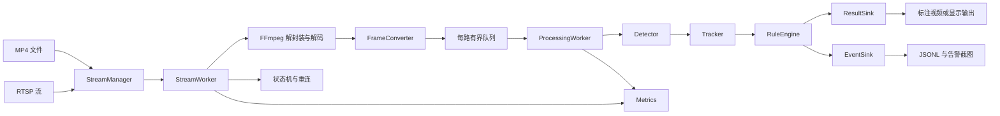

# 系统架构

## 1. 总体数据流



第一版采用“每路输入/解码线程 + 每路处理线程”的模型，优先保证生命周期和故障隔离清晰。共享推理线程池属于后续优化，不作为第一版的前置依赖。

## 2. 模块职责

### `StreamManager`

- 加载并校验全局配置。
- 创建、启动和停止多个 `StreamWorker`。
- 汇总各路状态和进程级指标。
- 处理全局致命错误，例如配置无效或模型加载失败。

### `StreamWorker`

负责单路流的生命周期和故障隔离：

- 管理输入、解码、转换、队列和输出资源。
- 维护当前状态、重连次数和最近错误。
- 通过停止令牌协调线程退出。
- 发生单路异常时进入重连或失败状态，不直接终止其他流。

### `VideoSource` 与 `Decoder`

`VideoSource` 描述输入地址和连接生命周期，`Decoder` 负责 FFmpeg 细节。两者不能混用：

- `VideoSource`：打开、关闭、连接状态、输入参数和错误原因。
- `Decoder`：解封装、查找视频流、解码 `AVPacket`、输出 `AVFrame`。

MP4 播放结束属于 `EndOfStream`，RTSP 读取超时或连接断开属于 `Disconnected`，两者必须有不同的处理策略。

### `FrameConverter`

- 使用 `libswscale` 将解码帧转换为模型所需的 BGR/RGB 格式。
- 每路维护独立的尺寸、像素格式和转换上下文。
- 保留原始 PTS、时间基、采集时间和单调时钟时间。
- 通过明确的帧所有权或缓冲池避免悬空引用和无界拷贝。

### `FrameQueue`

- 线程安全、有界、支持停止信号和超时等待。
- 同时限制最大帧数和最大帧龄。
- 实时模式默认丢弃旧帧，离线模式可配置为阻塞或不丢帧。
- 记录入队、出队、丢帧、队列峰值和丢帧原因。

### `Detector`

- 加载模型并校验输入输出签名。
- 执行 resize/letterbox、归一化、通道转换和 Tensor 创建。
- 解析类别、置信度和边界框。
- 执行类别过滤和 NMS。
- 输出统一的 `DetectionResult`，不得把模型特有格式泄漏给上层。

### `Tracker`

- 为检测结果分配和维护 `track_id`。
- 处理目标短暂丢失、轨迹超时和目标重新出现。
- 输出中心点、轨迹方向和轨迹状态。
- 断流重连后按配置清空或恢复轨迹。

### `RuleEngine`

- 根据检测和轨迹判断 ROI、越线、进入和离开事件。
- 对事件执行最小持续时间、冷却时间和去重。
- 只负责规则，不负责文件写入和网络发送。

### `ResultSink` 与 `EventSink`

- `ResultSink`：输出检测结果、标注视频或显示画面。
- `EventSink`：输出 JSONL、告警截图和事件统计。
- 输出失败不能阻塞核心检测链路；应记录错误并按配置停止当前输出或继续保留检测状态。

### `Metrics`

每路至少记录：输入 FPS、解码 FPS、推理 FPS、输出 FPS、P50/P95/P99 延迟、队列长度、接收帧、处理帧、丢帧、重连次数和最近一次错误。

## 3. 线程和队列模型

### 第一版

```text
每路输入/解码线程
    → 每路有界 FrameQueue
    → 每路处理线程
    → Detector → Tracker → RuleEngine
    → 异步 ResultSink/EventSink
```

输入线程只负责及时读取和解码，不执行模型推理。处理线程从有界队列中取帧；队列积压时通过丢弃旧帧保持实时性。

### 后续优化

```text
多路输入线程
    → 每路有界队列
    → InferenceScheduler
    → 共享 Detector 或批量推理
    → 按 stream_id 分发结果
```

共享推理需要额外解决公平调度、同一路结果顺序、模型线程数和 CPU/GPU 过度订阅问题。

## 4. 核心状态机

```text
Created → Connecting → Running
              ↑           ↓
              └── Reconnecting

任何运行态 → Stopping → Stopped
连接或解码达到不可恢复条件 → Failed
```

建议规则：

- 初次连接失败：进入 `Reconnecting`，按指数退避加随机抖动重试。
- 连续解码错误达到阈值：关闭并重建输入上下文。
- RTSP 读取超时：记录断流原因，不立即销毁整个进程。
- 达到最大重试次数：进入 `Failed`，由 `StreamManager` 决定是否保留任务。
- 收到停止信号：停止接收新帧，关闭队列，再按输入、处理、输出顺序释放资源。

## 5. 时间戳与帧所有权

每个 `FramePacket` 必须包含 `FrameMetadata` 和图像所有权信息：

- `stream_id`、单调递增的 `sequence` 和输入 `source_epoch`。
- 可为空的原始 `pts` 和 `time_base`。
- 输入接收时的墙上时钟 `received_at_unix_ms`。
- 输入接收时的单调时钟 `received_at_steady_ms`。
- 图像尺寸、像素格式、stride 和独立拥有的图像缓冲。

延迟统计使用单调时钟，不使用可能发生跳变的系统墙上时钟。事件时间和输出视频时间戳使用经过转换的源时间或明确的实时模拟时间。

## 6. 错误处理

| 错误 | 处理方式 |
|---|---|
| 配置无效 | 启动前校验失败，进程退出 |
| 模型加载失败 | 进程级致命错误，输出模型路径和签名原因 |
| 输入不存在 | MP4 进入失败或按配置重试；RTSP 进入重连 |
| 解码失败 | 丢弃当前包；连续失败达到阈值后重建上下文 |
| 单帧推理失败 | 记录 `stream_id` 和序号，跳过当前帧 |
| 队列满 | 按策略丢弃旧帧，增加丢帧计数 |
| 输出失败 | 停止当前输出，保留或终止检测状态由配置决定 |

