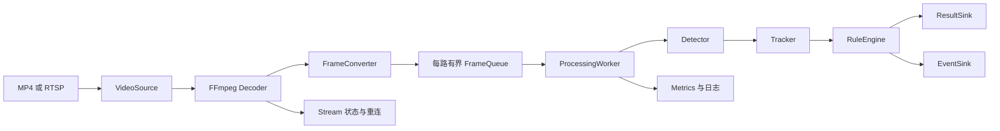

# 多路 RTSP 视频分析项目：框架分析与新手实施指南

> 分析日期：2026-10-04
> 项目状态：架构设计阶段，不是已经可以直接运行的完整程序。

## 1. 先看结论

这个仓库目前主要是设计文档和配置模板，尚未包含真正的 C++ 实现。当前没有：

- `CMakeLists.txt` 或 `CMakePresets.json`；
- `src/*.cpp`、`include/*.hpp`；
- 可运行的 `main` 入口；
- GoogleTest 测试代码；
- 实际 ONNX 模型和测试视频。

所以你现在面对的不是“先把一个现成项目跑起来”，而是“按照已有设计，从空工程逐步实现一个视频分析系统”。正确顺序应该是：

```text
先做单路 MP4 → 再接入模型 → 再做跟踪和事件 → 再做单路 RTSP → 最后做多路并发和故障恢复
```

不要一开始就直接做四路 RTSP、多线程、目标检测和越线告警。那样出现问题时，你很难知道是解码、模型、线程、网络还是内存所有权出了问题。

## 2. 用一句话理解系统

系统做的事情是：

```text
读取视频 → 解码成一帧一帧的图像 → 目标检测 → 给目标分配 ID → 判断业务事件 → 输出结果和指标
```

可以把它理解成一条流水线：

| 模块 | 新手类比 | 实际职责 |
|---|---|---|
| MP4/RTSP | 摄像头或视频文件 | 提供原始视频数据 |
| FFmpeg | 翻译器 | 把压缩的视频包解码成图像帧 |
| `FramePacket` | 运输箱 | 携带图像、帧号和时间戳 |
| `FrameQueue` | 传送带缓冲区 | 在解码速度和推理速度不一致时限流 |
| `Detector` | 眼睛 | 找出人、车、卡车、公交车和位置 |
| `Tracker` | 记忆力 | 判断这一帧的目标是不是上一帧的同一个目标 |
| `RuleEngine` | 业务判断员 | 判断进入区域、离开区域、越线等事件 |
| `ResultSink/EventSink` | 输出仓库 | 保存标注视频、JSONL、截图和事件 |
| `Metrics/日志` | 仪表盘 | 记录 FPS、延迟、丢帧、重连和错误 |

## 3. 当前项目的目录职责

```text
multi_rtsp_video_analysis/
├─ README.md                         项目目标和推荐顺序
├─ docs/
│  ├─ requirements.md                需求和验收标准
│  ├─ architecture.md                数据流、模块职责、线程模型、状态机
│  ├─ data-models.md                 跨模块数据契约
│  ├─ configuration.md               YAML 配置字段和校验规则
│  ├─ output-schemas.md              JSONL/指标输出格式
│  ├─ dependency.md                  第三方依赖和构建要求
│  ├─ development-roadmap.md         阶段性开发路线
│  ├─ testing.md                     测试、故障注入和性能指标
│  └─ decisions/001-thread-model.md  第一版线程模型决策
├─ configs/
│  ├─ example.yaml                   配置样例
│  └─ README.md                      配置使用约定
├─ models/
│  ├─ model-manifest.example.yaml    模型输入输出说明模板
│  └─ README.md                      模型来源、许可证和校验要求
├─ src/README.md                     未来实现代码的模块建议
├─ include/README.md                 未来公共头文件建议
├─ tests/README.md                   未来测试层级建议
└─ scripts/README.md                 未来环境、构建、RTSP 和测试脚本建议
```

你应该先按文档理解边界，再创建真正的 `src`、`include`、`tests` 和 CMake 文件。

## 4. 系统主数据流



实际运行时，第一版建议每一路使用两条核心线程：

```text
输入/解码线程 → 有界队列 → 处理线程
```

处理线程内部再依次调用：

```text
Detector → Tracker → RuleEngine → 输出
```

这就是 `docs/decisions/001-thread-model.md` 采用“每路输入线程 + 每路处理线程”的原因：故障边界清楚，容易调试，适合第一版四路规模。

## 5. 你需要实现的核心模块

### 5.1 `main.cpp` 和 `StreamManager`

程序入口只负责流程编排，不应该塞进所有业务逻辑。建议由它完成：

1. 读取命令行参数，例如配置文件路径；
2. 加载 YAML；
3. 校验配置和模型 manifest；
4. 创建 `StreamManager`；
5. 启动所有 `StreamWorker`；
6. 响应 Ctrl+C 或停止信号；
7. 按顺序停止线程并释放资源。

`StreamManager` 是“总管”，管理所有流；`StreamWorker` 是“一路流的管家”，管理单路输入、队列、处理和输出。

### 5.2 `VideoSource` 和 `Decoder`

这两个概念要分开：

- `VideoSource` 关心输入是什么、是否连接、什么时候关闭、错误是什么；
- `Decoder` 关心 FFmpeg 的 `AVFormatContext`、`AVCodecContext`、`AVPacket` 和 `AVFrame`。

FFmpeg 中几个最重要的对象：

- `AVPacket`：压缩后的视频数据包；
- `AVFrame`：解码后的图像帧；
- PTS/time base：描述帧在源视频时间轴上的位置；
- `AVCodecContext`：具体编解码器的上下文。

MP4 播放结束是正常的 `EndOfStream`；RTSP 超时或网络断开是 `Disconnected`。两种情况不能用同一套处理逻辑。

### 5.3 `FramePacket` 和 `FrameQueue`

`FramePacket` 是解码线程和处理线程之间的唯一契约，至少应包含：

- `stream_id`；
- 递增的 `sequence`；
- 原始 `pts` 和 `time_base`；
- 接收时间；
- 单调时钟时间；
- 宽、高、像素格式；
- 图像数据和明确的所有权。

`FrameQueue` 必须是线程安全且有上限的。实时视频通常使用 `drop_oldest`：当推理跟不上输入时，丢掉旧帧，尽量处理最新画面。否则队列会越积越多，最终同时造成内存增长和实时延迟失控。

### 5.4 `Detector`

`Detector` 的职责是把模型的特殊输入输出格式隐藏起来，向上层提供统一检测结果：

```text
Detection {
    class_id
    label
    confidence
    bbox
}
```

内部步骤通常是：

```text
cv::Mat
  → resize/letterbox
  → BGR/RGB 转换
  → 归一化
  → NCHW Tensor
  → ONNX Runtime 推理
  → 解析输出
  → 置信度过滤
  → NMS
  → 原图坐标检测框
```

不要看到一个模型就假设它的输出格式。应以 `model-manifest.example.yaml` 为契约，记录模型的尺寸、布局、颜色顺序、归一化、类别顺序和输出格式。

### 5.5 `Tracker`

检测模型只会告诉你“当前画面里有几个目标”，但不会天然知道两帧之间的目标是否为同一个。因此需要 Tracker 维护：

- `track_id`；
- 当前中心点和上一帧中心点；
- 已存在帧数；
- 连续丢失帧数；
- `Tentative/Confirmed/Lost/Removed` 状态。

第一版不需要实现复杂的 DeepSORT。可以从“基于中心点距离或 IoU 的简单匹配”开始，先保证 ID 基本稳定。

### 5.6 `RuleEngine`

`RuleEngine` 只处理业务规则，不负责写文件。建议按以下顺序实现：

1. 每帧目标数量；
2. 矩形 ROI 内目标数量；
3. 区域进入和离开；
4. 越线方向判断；
5. 事件冷却和去重。

事件至少要带上 `event_id`、`stream_id`、`event_type`、时间、帧序号和相关 `track_ids`。同一个目标在冷却时间内不应重复告警。

### 5.7 输出和可观测性

第一版输出建议只做三类：

- 标注视频：方便肉眼确认检测框和轨迹；
- Detection JSONL：每帧一行检测结果；
- Event JSONL：每个事件一行。

同时记录：

- 输入、解码、推理、输出 FPS；
- P50/P95/P99 延迟；
- 队列深度和峰值；
- 接收、处理、丢弃帧数；
- 重连次数和最后错误。

延迟必须用单调时钟计算，不能直接用可能跳变的系统墙上时间。

## 6. 新手推荐的实现顺序

下面的顺序比“先做完整架构”更重要。每个阶段都要有可运行结果。

### 阶段 0：准备环境和测试资产

**目标**：明确你要使用的编译器、库、模型和视频。

准备：

- C++17 编译器；
- CMake；
- FFmpeg；
- OpenCV；
- ONNX Runtime；
- GoogleTest；
- 一个有授权的本地 MP4；
- 一个与你的模型匹配的 ONNX 文件；
- 一份真实的模型 manifest。

**完成标志**：能够确认每个依赖的版本，知道头文件、库文件和运行时 DLL/so 的位置；模型和视频来源、许可证清晰。

### 阶段 1：创建能编译的 CMake 空工程

**先创建这些文件**：

```text
CMakeLists.txt
CMakePresets.json
src/main.cpp
include/app/version.hpp
tests/unit/smoke_test.cpp
```

`main.cpp` 先只做一件事：输出版本和启动信息。不要马上接 FFmpeg。

同时建立：

- Debug/Release 构建；
- 一个最小单元测试；
- 编译器警告；
- 输出目录约定；
- 基础日志接口。

**完成标志**：

```text
cmake 配置成功
cmake 构建成功
ctest 通过
程序能输出版本信息
```

### 阶段 2：实现配置读取和校验

以 `configs/example.yaml` 为输入，先完成：

- YAML 读取；
- 默认值；
- 必填字段检查；
- `mp4`/`rtsp` 类型检查；
- 阈值范围检查；
- 队列策略枚举检查；
- 未知字段拒绝；
- `${ENV_NAME}` 环境变量替换；
- 错误配置在创建线程之前失败。

建议先定义 C++ 配置类型：

```text
AppConfig
ModelConfig
QueueConfig
OutputConfig
StreamConfig
ReconnectConfig
RuleConfig
```

**完成标志**：有效配置能打印摘要；故意写错路径、阈值、类型或字段时，程序能输出明确错误并退出。

### 阶段 3：只实现单路 MP4 解码

这是最关键的基础阶段。先不要 RTSP、不要多线程、不要模型。

实现顺序：

1. 用 FFmpeg 打开 MP4；
2. 查找视频流；
3. 创建解码器；
4. 使用 `avcodec_send_packet/receive_frame` 解码；
5. 维护帧序号；
6. 保存 PTS 和 time base；
7. 将 `AVFrame` 转为 `cv::Mat`；
8. 打印帧号、宽高、PTS；
9. 正确释放所有 FFmpeg 对象。

第一阶段可以把每帧保存成图片，或只输出前 100 帧的元数据。这样比直接接模型更容易定位问题。

**完成标志**：单路 MP4 能连续读取，帧尺寸正确，PTS 基本单调，程序结束时没有明显资源泄漏。

### 阶段 4：加入 OpenCV 输出和单路检测

先让 `Detector` 接受一张 `cv::Mat`，不要让它直接依赖 FFmpeg 对象。完成：

1. 加载模型 manifest；
2. 创建 ONNX Runtime session；
3. 实现 resize/letterbox；
4. 实现 RGB/BGR 和归一化；
5. 创建输入 Tensor；
6. 执行推理；
7. 解析输出；
8. 做置信度过滤和 NMS；
9. 把坐标映射回原图；
10. 绘制检测框；
11. 输出 Detection JSONL。

**完成标志**：单路 MP4 能得到标注视频，每一帧检测结果符合 `docs/output-schemas.md`。

### 阶段 5：加入 Tracker 和事件规则

先用简单 Tracker：中心点距离或 IoU 匹配即可。完成：

- `track_id` 分配；
- 轨迹超时和删除；
- ROI 计数；
- 越线方向；
- 进入/离开事件；
- 冷却时间；
- 事件去重；
- 告警截图。

先用人工构造的检测框写单元测试，不要一开始依赖真实视频才能测试规则。

**完成标志**：同一个目标在冷却窗口内不会重复告警，越线事件包含方向、规则 ID 和 `track_id`。

### 阶段 6：接入单路 RTSP 和重连

使用 MediaMTX 把本地 MP4 按实时速度发布为 RTSP。然后再实现：

- 连接超时；
- 读取超时；
- 断流识别；
- 指数退避；
- 最大重试次数；
- 断流时状态切换；
- 恢复后重新进入 `Running`。

状态机建议是：

```text
Created → Connecting → Running
              ↑           ↓
              └── Reconnecting

任何运行态 → Stopping → Stopped
不可恢复错误 → Failed
```

**完成标志**：停止 RTSP 发布后系统记录断流，恢复发布后系统能自动重连；MP4 EOF 不会被错误地当成 RTSP 断流。

### 阶段 7：实现多路并发和有界队列

此时再引入 `StreamManager` 和 `StreamWorker`：

- 每路独立输入线程；
- 每路独立处理线程；
- 每路独立队列；
- 每路独立 Tracker；
- 每路独立输出目录；
- 每路独立指标；
- 一路失败不影响其他路。

实时模式默认使用 `drop_oldest`，离线 MP4 可以使用阻塞或不丢帧策略。

**完成标志**：四路本地模拟 RTSP 可以同时运行；停止其中一路后，其他路继续处理；队列长度和内存保持有界。

### 阶段 8：故障注入、性能和工程化

最后再做：

- 连接失败；
- 读取超时；
- 连续解码错误；
- 人为变慢推理；
- 输出目录不可写；
- 磁盘写入失败；
- 长时间运行；
- 增加路数直到出现吞吐拐点；
- P50/P95/P99 延迟统计；
- Sanitizer、调试器和性能分析。

**完成标志**：有固定测试配置、原始指标和故障记录；性能数字能够追溯到硬件、模型、视频和测试时长。

## 7. 建议的最终代码结构

当阶段 1 到阶段 7 逐步完成后，可以形成类似下面的结构：

```text
CMakeLists.txt
CMakePresets.json
include/
├─ app/
├─ config/
├─ input/
│  ├─ video_source.hpp
│  ├─ decoder.hpp
│  └─ frame_converter.hpp
├─ pipeline/
│  ├─ frame_packet.hpp
│  ├─ frame_queue.hpp
│  └─ stream_worker.hpp
├─ inference/
│  ├─ detector.hpp
│  └─ model_manifest.hpp
├─ tracking/
│  └─ tracker.hpp
├─ events/
│  └─ rule_engine.hpp
├─ output/
│  ├─ result_sink.hpp
│  └─ event_sink.hpp
└─ observability/
   ├─ logger.hpp
   └─ metrics.hpp
src/
├─ main.cpp
├─ config/
├─ input/
├─ pipeline/
├─ inference/
├─ tracking/
├─ events/
├─ output/
└─ observability/
tests/
├─ unit/
├─ module/
├─ integration/
└─ fault_injection/
```

不要为了“看起来完整”一次创建所有文件。按阶段创建，哪个模块先有可验证行为，哪个模块先落地。

## 8. 新手最应该掌握的几个难点

### 难点一：帧的生命周期

FFmpeg 解码器可能复用内部缓冲区。不能把一个马上会被复用的 `AVFrame` 指针直接放进队列，交给另一个线程使用。你需要明确：复制图像、引用计数，或使用安全的对象池。

### 难点二：时间戳和延迟不是一回事

- PTS：视频源时间轴上的位置；
- 墙上时间：用于记录实际日期时间；
- 单调时钟：用于计算延迟和耗时。

延迟计算应使用单调时钟，事件和输出视频时间可以使用经过转换的源 PTS。

### 难点三：实时性和完整性冲突

实时 RTSP 更重视“现在看到的画面”，所以推理慢时通常丢旧帧；离线 MP4 更重视“每帧都处理”，可以阻塞等待。这个策略应写进配置，不能隐藏在业务代码里。

### 难点四：检测和跟踪不是一回事

检测回答“当前有哪些目标”；跟踪回答“当前目标是否还是之前的那个目标”。越线事件依赖跟踪，而不是只依赖检测框。

### 难点五：停止流程

多线程程序最容易在停止时出错。正确顺序通常是：停止接收新帧 → 关闭队列 → 等待处理线程退出 → 停止输出 → 释放 FFmpeg/OpenCV/模型资源。

## 9. 不建议现在做的事情

- 不要先做 GUI；先把 JSONL 和标注视频跑通。
- 不要先做共享推理线程池；四路以内先用每路独立处理线程。
- 不要把配置写死在 C++ 中；使用现有 YAML 配置。
- 不要使用没有 manifest 的随便一个模型。
- 不要用无限队列解决推理变慢问题。
- 不要把所有代码塞进 `main.cpp`。
- 不要拿没有授权的摄像头地址做测试。
- 不要在没有固定硬件、模型和输入的情况下声称 FPS 或延迟。

## 10. 你现在最应该做的第一轮任务

建议只做以下 5 件事：

1. 安装并确认 C++17 编译器、CMake、FFmpeg、OpenCV、ONNX Runtime 和 GoogleTest。
2. 创建最小 `CMakeLists.txt` 和 `src/main.cpp`，让程序成功编译并打印版本。
3. 实现 YAML 配置读取和校验，但暂时只打印配置摘要。
4. 实现单路 MP4 解码，把前 100 帧的序号、尺寸、PTS 打印出来。
5. 为 `FramePacket`、时间戳转换和配置校验各写一个单元测试。

完成这五件事后，再进入模型推理。你的第一个里程碑不是“多路 RTSP 检测”，而是：

```text
一个能稳定打开 MP4、正确输出帧信息、能通过测试的 C++ 程序
```

## 11. 推荐阅读顺序

1. `README.md`：了解目标和边界；
2. `docs/requirements.md`：知道验收什么；
3. `docs/architecture.md`：理解数据流和模块职责；
4. `docs/data-models.md`：先确定跨线程数据结构；
5. `configs/example.yaml`：理解配置形状；
6. `docs/configuration.md`：实现配置校验；
7. `docs/development-roadmap.md`：按阶段推进；
8. `docs/testing.md`：每个阶段都验证，不要最后才测试。

如果按这个顺序推进，这个项目的学习重点会自然分层：先学 CMake 和 C++ 工程，再学 FFmpeg 解码，再学 OpenCV/ONNX，再学多线程和 RTSP，最后做稳定性和性能。
